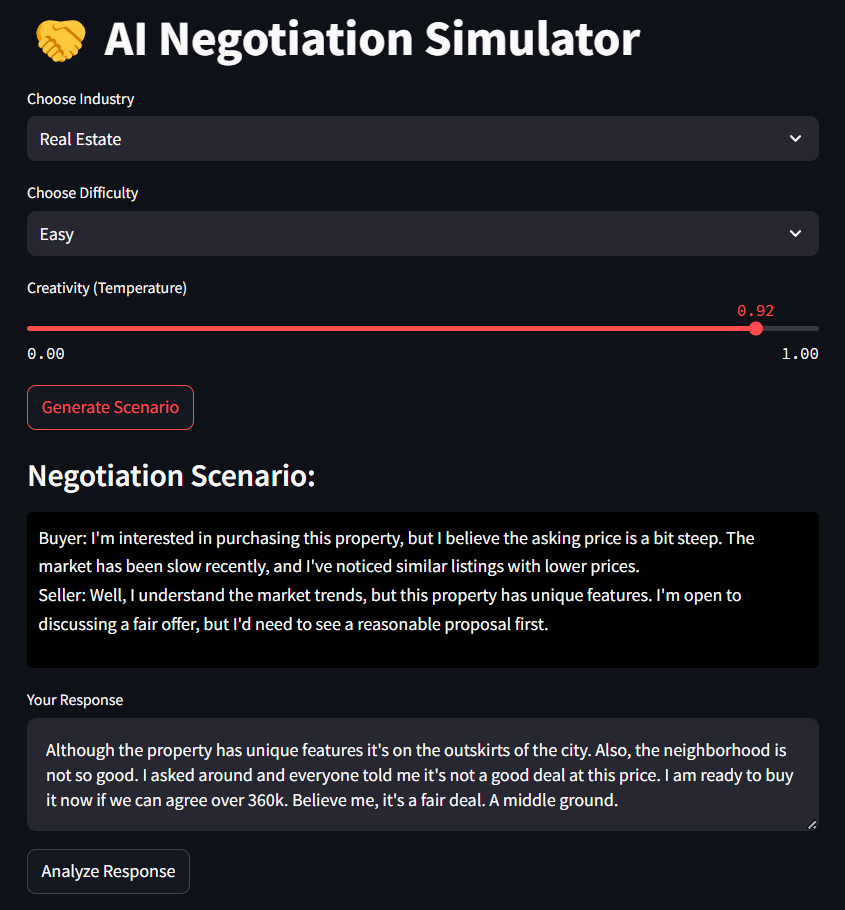
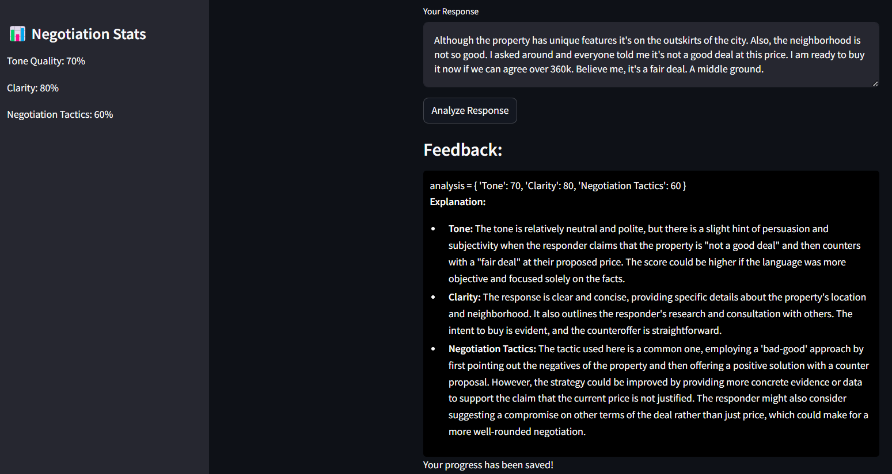

# AI_negotiation_simulator

# 🤝 AI Negotiation Simulator

Welcome to the **AI Negotiation Simulator**! This innovative application leverages the power of AI to enhance your negotiation skills through personalized scenarios and real-time feedback. Whether you're preparing for a business deal, practicing for a job interview, or simply honing your negotiation tactics, this simulator is designed to make the learning process engaging and effective.

## 🌟 Features

- **Tailored Scenarios**: Generate negotiation scenarios based on your chosen industry (Tech, Real Estate, Healthcare, Finance) and difficulty level (Easy, Intermediate, Advanced).
- **Real-Time Analysis**: Get immediate feedback on your negotiation responses, including scores for tone, clarity, and negotiation tactics.
- **Constructive Feedback**: Receive personalized suggestions to improve your negotiation skills.
- **Progress Tracking**: Save your progress and review your growth over time.

## 🚀 Getting Started

### Prerequisites

Before you begin, ensure you have the following installed:

- Python 3.7 or higher
- Streamlit
- Cohere API key (Sign up at [Cohere](https://cohere.ai/) to obtain your API key)

### Installation

1. Clone the repository:
   ```bash
   git clone https://github.com/HrithikRai/AI_negotiation_simulator.git
   cd AI_negotiation_simulator.git
2. pip install -r requirements.txt
3. streamlit run app.py



